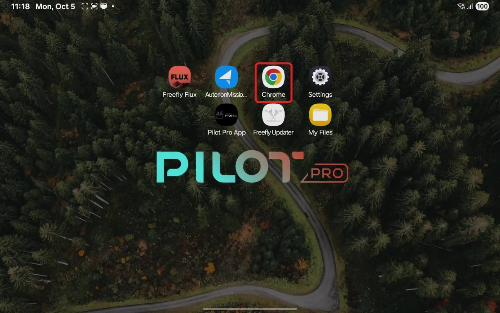

# FAA Remote Idenitificatio (RID)

To register your Astro with the FAA, you need its Remote ID Serial Number, a number that starts with **18179**. The quickest way to find it is from the Chrome browser on your Pilot Pro, with no laptop or USB cable needed.


You may have seen instructions that connect the drone to a computer over USB and open 10.41.1.1. That works, but company-managed computers have been known to block USB network devices, so the Pilot Pro method below is our recommended workflow.


### Find your Remote ID Serial Number 



### Power on Astro and Pilot Pro.

Wait for them to fully boot and connect. The LED on the Pilot Pro power button should be <mark style="color:$success;">**green**</mark>, indicating the radio modules are paired.



### Open Google Chrome

If you don't have it on your tablet home page, swipe up from the center of the screen to access all your apps. It will be nested under the "Google" folder. You can also use any other browser you wish.&#x20;

<figure><figcaption></figcaption></figure>




### Navigate to AuterionOS

Tap the address bar, type `192.168.144.20`, then tap **Go**.


Connection to the internet is not required for this step. This is connecting you directly to the Skynode onboard the aircraft.


<figure><figcaption></figcaption></figure>




### Copy your Remote ID Serial Number

The drone's page loads in a tab labeled AuterionOS (it can take a few seconds). Under **Information** at the top, find **Remote ID Serial Number**. It starts with **18179**. You can tap the copy icon next to it to copy it.

<figure><figcaption></figcaption></figure>


Note that the **Remote ID Serial Number** is simply your **Skynode Serial Number** with the 18179 prefix. This identifies your aircraft to the FAA that it is made by Freefly Systems. The range of valid Astro RID serial numbers is between 18179130000000 - 1817913FFFFFFF, using the [hexadecimal](https://en.wikipedia.org/wiki/Hexadecimal) numbering system.



Alternative to Pilot Pro: You can also access the AuterionOS page by connecting your aircraft to a computer via USB-C. Then open a browser on the computer to `10.41.1.`




### Register with the FAA

Enter this number as the Remote ID serial number when you register your Astro on the [FAA DroneZone](https://faadronezone-access.faa.gov/) website.&#x20;



### Tip: add a home screen shortcut 

You can save this page as an icon on the Pilot Pro home screen, so next time it's one tap instead of typing the address. With the page open in Chrome, tap the **⋮** menu in the top right, then tap **Install and create shortcut**. You may need to scroll down in the menu to see it.

<figure><figcaption></figcaption></figure>

***

### Enabling RID on Astros shipped before Feb 2024

Enabling Remote ID on Astros shipped pre-RID

Any Astro that shipped before February 2024 can be **upgraded to be Standard Remote ID compliant**. Upgrade can be done by the pilots in the field without any additional hardware required.

### 1. Update Astro firmware to v1.5 or above

* Download firmware v1.5 or above from the [Software Release Notes](../../maintenance/software-release-notes/) page
* Follow update instructions [software.md](../../maintenance/software-release-notes/software.md "mention")


Firmware updates should be done over USB. While the webui is accessible via the Pilot Pro, updating firmware over the RF link is slow


### 2. Enable Remote ID

* After the firmware update is completed, keep the Astro connected with the USB cable and navigate to the [Astro's Settings page](http://10.41.1.1/settings)
* Press the Remote ID toggle (shown in image), then accept to enable.

<figure><figcaption></figcaption></figure>

### 3. Register

* Once Remote ID is enabled, you can get your Remote ID Serial Number. This number is different from Astro's hardware serial number.
* Affix a label to your drone
  * Remote ID rule requires standard Remote ID aircraft to display a label indicating the drone complies with the rule. Print a label that indicates "FAA Standard Remote ID Compliant" and use a tape or adhesive to securely affix it to your drone. The label must be in English and be legible, prominent, and permanently affixed to the unmanned aircraft.

