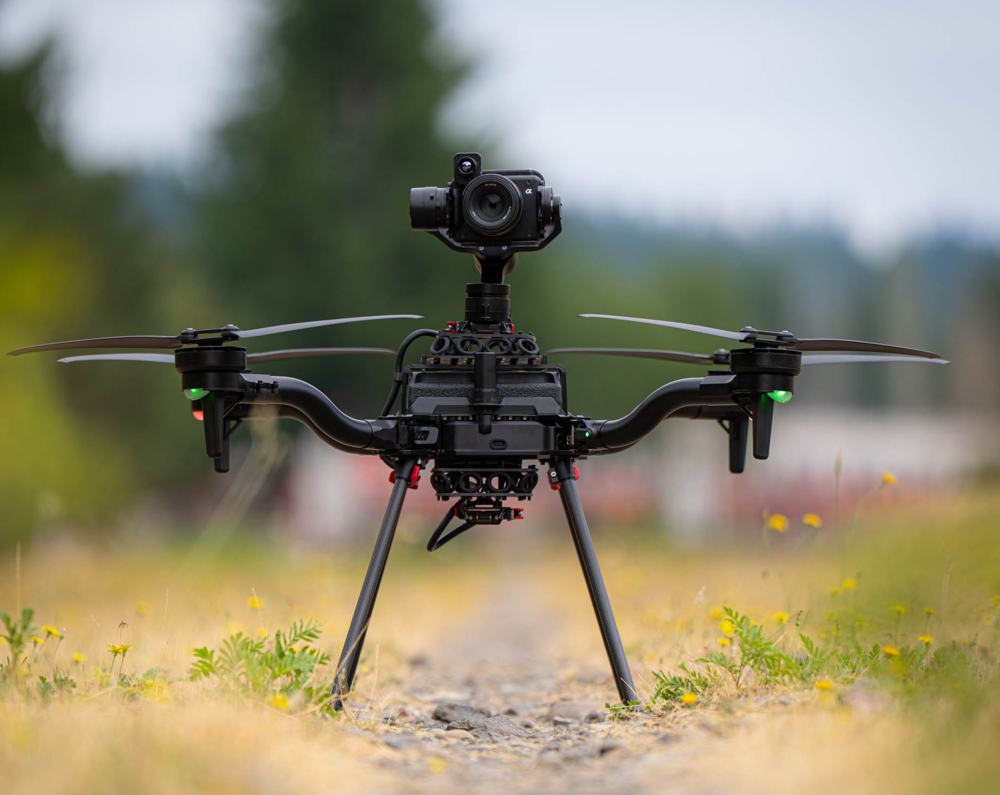
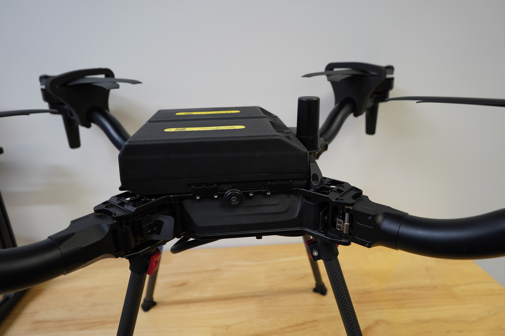
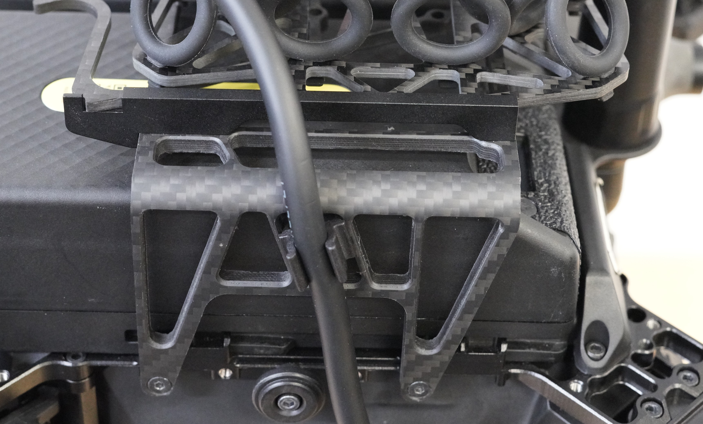
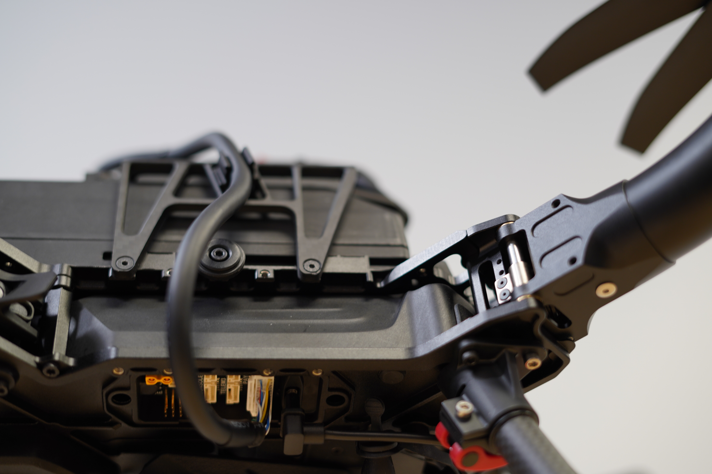

# Skyview Payload Mount

<figure><figcaption></figcaption></figure>

## Overview

The top mounting bracket and isolation system allows for an unobstructed upward view when using gimballed payloads. This enables unique inspection applications such as the undersides of bridges, wind turbines, and more.&#x20;


Compatible with:&#x20;

* Astro&#x20;
* Astro Max&#x20;
* LR1 Payload&#x20;
  * Running gimbal FW 2.2 or later
* OGI Payload
  * Running gimbal FW 2.2 or later&#x20;
* Gremsy VIO&#x20;
  * Running gimbal FW 7.8.6 or later&#x20;



Be careful when operating in areas with partial GNSS obstruction, such as underneath bridges. Astro may drift in poor GPS conditions, or switch to Altitude mode if GNSS lock is lost.&#x20;


## Installation:&#x20;

1.  Remove the carrying strap from Astro

    <figure><figcaption></figcaption></figure>
2.  Install the top mount bracket using QTY 4 M3 x 10 FHCS screws and a 2.5mm hex driver

    <figure><figcaption></figcaption></figure>
3.  Slide the isolator cartridge sled with the desired durometer into the top mount&#x20;

    <figure><figcaption></figcaption></figure>


Be sure both clips on the isolator sled are engaged!&#x20;

.JPG>)


4.  Clip the ZPD cable into the side of the top mount bracket, then plug it into the ZPD port on the underside of Astro. Be sure to seat the connector all the way

    <figure><figcaption></figcaption></figure>

    <figure><figcaption></figcaption></figure>
5.  With the aircraft off, install the gimbal and close the lever. Orient the gimbal with the camera 'alpha' logo facing the right side up

6. Power on the aircraft and wait for Position lock&#x20;

<figure><figcaption></figcaption></figure>


Astro may take longer to achieve a position lock with top mount installed, and may have slightly more drift in position mode. Use caution when flying close to objects


## Isolator Cartridges:&#x20;

Currently, we are offering a 30A durometer top mount isolator cartridge, which is compatible with the LR1 Payload, OGI payload, and Gremsy VIO.

## Packaging:&#x20;


The top mount rack can stay installed when inserting Astro into the compact travel case if the isolator sled is removed.&#x20;


## #Protips:&#x20;


Be careful when operating in areas with partial GNSS obstruction, such as underneath bridges. Astro may drift in poor GPS conditions, or switch to Altitude mode if GNSS lock is lost.&#x20;



'**Gimbal Center**', '**Gimbal 45**' and '**Gimbal 90**' buttons in AMC currently don't work with the gimbal in top mount/skyview mode


* For applications with very poor or no GPS, the Emesent Hovermap ST or ST-X payload can provide SLAM positioning and obstacle avoidance. Emesent is working on adding support for top mount on Astro


[hovermap-st-x-and-st-lidar](../../3rd-party-payloads/hovermap-st-x-and-st-lidar/)

