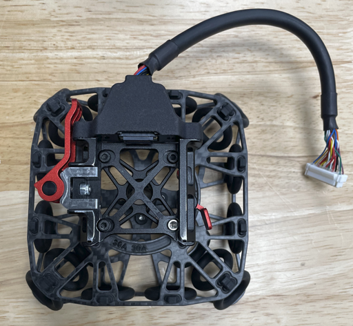

# Vibration Isolators

### Isolator Configuration

There are several different isolator designs for Astro:

*   Astro Max Isolator - This isolator is the latest version of the Smart Dovetail Isolator for payloads on Astro Max

    <figure><figcaption>
Astro Max Isolator
</figcaption></figure>
* Astro Isolator - This isolator is an updated version of the Smart Dovetail Isolator for better vibration rejections and robustness on Astro, and some payloads on Astro Max

<figure><figcaption>
Astro Isolator
</figcaption></figure>

* \[Obsolete] Smart Dovetail/Mapping Isolator - This isolator shipped with early Mapping Payloads and has the Smart Dovetail connector for payloads that use the Pixhawk Payload Standard.&#x20;
* \[Obsolete] Integrator Isolator - This is best for custom payloads and offers several mounting bolt patterns. It does not have any electrical connection to the aircraft.&#x20;

Isolators can be configured for a variety of payloads by adjusting the stiffness (durometer) of the dampers. A good rule of thumb is if your payload is swinging too much the system needs more stiffness and if the payload is vibrating it needs less!

<figure><figcaption>
Which isolator should I use for my payload?
</figcaption></figure>

## Astro Max Isolator

The Astro Max Isolator is designed for Astro Max and can carry up to 3kgs of payload with different durometers for various payloads. See the above chart for the recommended durometers.&#x20;

How to install:&#x20;

<figure><figcaption></figcaption></figure>

<figure><figcaption></figcaption></figure>

<figure><figcaption></figcaption></figure>

## Astro Isolator

<figure><figcaption></figcaption></figure>

This isolator works well for most payloads that use the Smart Dovetail connector and weigh up to 1.5kg. This includes the Mapping Payload and the Wiris Pro Payload. The isolator comes with 6x 30A durometer Dampers, and mounts to the bottom of the Astro lower chassis. To install:&#x20;

1. Use a M3x6 BHCS to attach the safety cable to the aircraft, applying Loctite 222 or similar to the fastener.&#x20;
   1.

       <figure><figcaption></figcaption></figure>
2. Use QTY 3 M3x8 SHCS to attach the isolator cartridges to the aircraft, applying Loctite 222 or similar to the fasteners.&#x20;
3.

    <figure><figcaption></figcaption></figure>
4.  Then plug the payload connector cable into the I/O port.

    <figure><figcaption></figcaption></figure>

## Mapping Isolator


We recommend upgrading to the Astro Isolator for the best performance


This isolator is tuned for the Mapping Payload and comes with 4x 30A durometer Dampers.

1. When using this isolator with the Mapping Payload we do not recommend altering the stiffness to ensure the systems performs optimally. We do not recommend using this isolator with the Wiris Pro Payload&#x20;
2. To install the isolator, use 4 M3x8 BHCS to attach the top plate of the isolator structure to the aircraft, applying Loctite 222 or similar to the fasteners. &#x20;

 

3\. Use a M3x6 BHCS to attach the safety cable to the aircraft, applying Loctite 222 or similar to the fastener.&#x20;

4\. Then plug the payload connector cable into the I/O port.

5\. Insure the damper washers are installed on the bottom of the dampers. These prevent the isolator dampers from being pulled through the metal structure during aggressive flight maneuvers. &#x20;

 

## Integrator Isolator

This isolator is best for custom payloads and has several mounting options. The mounting points and dimensions are available [here](https://freefly.gitbook.io/astro-public/astro/specs-and-interfaces/drawings-and-cad)&#x20;

.jpg>)

1. This isolator kit comes with 6 x 30A durometer Dampers.
2.  To increase isolator stiffness try the following;

    A. Increase the durometer of the dampers to 40A or 50A. These are available in our [store](https://store.freeflysystems.com/collections/astro/products/astro-vibration-isolator-set)
3.  To decrease isolator stiffness try the following;

    A. Decrease the number of Isolators to 4 by removing one damper from the front right and left pair. This is only recommended for payloads lighter than 400g.
4.  To install the isolator:

    A. Pull 3 sets of the desired Dampers through the outer holes on the isolator plate.&#x20;

    <figure><figcaption></figcaption></figure>

    B. Install the Damper washers. Pinch the Dampers and gently slide the rubber into the slit in the washer.&#x20;

    
<figure><figcaption></figcaption></figure> <figure><figcaption></figcaption></figure>

    C. Flip over Astro and locate the three M3 holes highlight below

    <figure><figcaption></figcaption></figure>

    D. Use QTY 3 of M3 x 8 SHCS screws to attach the isolator to the chassis of Astro, applying Loctite 222 or similar to the fasteners. &#x20;

    <figure><figcaption></figcaption></figure>

#### Damper Identification

1.  Isolator dampers durometers can be identified using the cap color;

    A. White/Light Grey - 30A

    B. Dark Grey - 40A

    C. Black - 50A&#x20;


Some early production dampers will not follow this convention and will be colored black even though they have a hardness of 30A.


