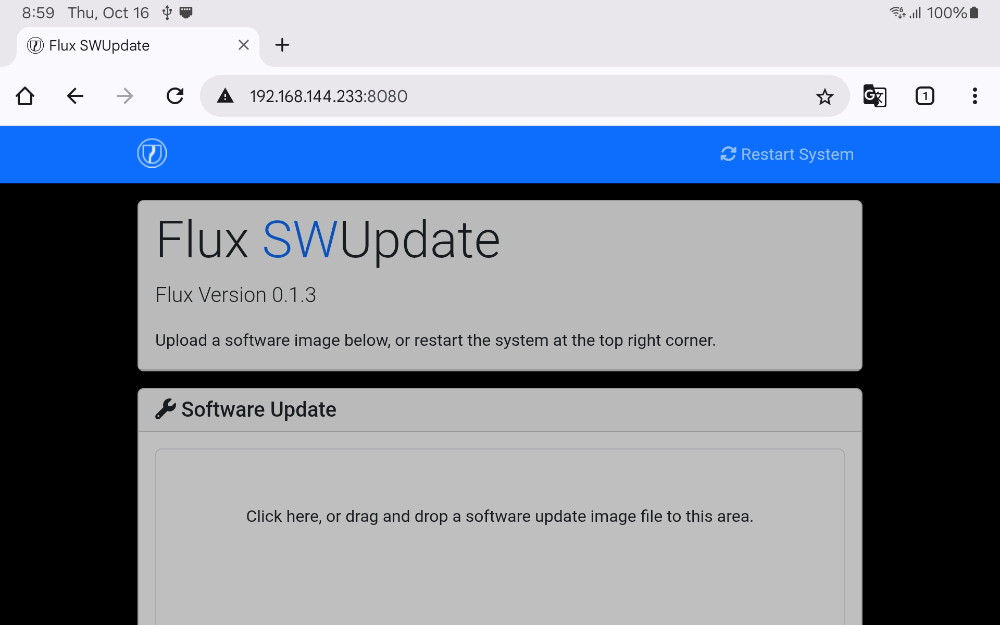

# Flux Software

### Connect to Flux Update Webpage

To check Flux firmware version or update software:&#x20;

* Power on Flux while connected to Astro
* Access to Flux Update Webpage at [192.168.144.233:8080](http://192.168.144.233:8080/) from:
  * Pilot Pro tablet
  * iPad connected to Pilot Pro
  * Computer connected to pilot Pro via Ethernet
* &#x20;Access to Flux Update Webpage at [192.168.0.1:8080](http://192.168.0.1:8080/) from:
  * USB-C Ethernet adapter connected to Flux\
    Flux USB does not support USB device mode, a USB Network adapter must be used.

<figure><figcaption></figcaption></figure>

### Software Version

The Flux software version is listed at the top of the page:&#x20;

<figure><figcaption></figcaption></figure>

### Web Software Update

* Provide Flux software file
* Update will validate file and install update
* Flux will reboot once install is complete
* Refresh web browser for version to update

<figure><figcaption></figcaption></figure>

### USB Software Update

* Format USB Storage on Flux via Flow App
* Copy Flux software file to USB Storage root directory
* Insert USB Storage into Flux
* System will reboot if Software Update is a newer version

### System Recovery

If Flux is not running correctly due to a failed or invalid update, System Recovery can be triggered by pressing Flux button when powering up. Recovery will execute the factory software instead of any installed update.

If an software update is present on the USB Storage, the factory software will install it and reboot.\
It is recommended to disconnect USB Storage when performing System Recovery to allow connection with the Flow App. Software update can be performed afterwards.&#x20;

### Latest Software:&#x20;

#### Release Notes

1.0.0

* Initial release for Freefly Flux L1, O1, and H1&#x20;
