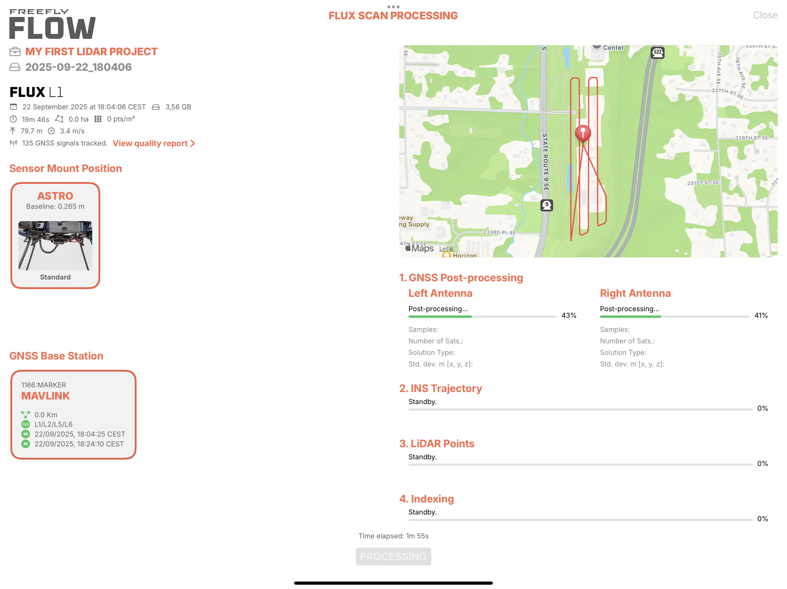

# Processing LiDAR data on an iPad

## Download the Freefly Flow app

On your iPad, go to the App Store and search for Freefly Flow to get the latest version of our app.&#x20;



## Create a new project 

When launching the Flow app, you will get a project browser view where you will have access to recent projects. You can also open an existing project with the import button on the top right corner.

Click on the '**+**' button to create a new project.

<figure><figcaption></figcaption></figure>



## Name your project and select your coordinate reference system

Give a nice name to your project and select your desired coordinate reference system.

By default the app will propose the **EPSG:4979**, which is the standard on most GNSS receivers. It is a **WGS84** reference system with coordinates as latitude, longitude and height in meters above the ellipsoid.

To choose a different one, click on the 'x' next to the name to clear it and search for the desired one among more than **6,500 available**.


Searching for EPSG # codes makes it easier to find the coordinate system you're looking for



To avoid offset errors in your data, match the units (meters or feet) of the horizontal and vertical coordinate systems for your project


For this tutorial, we will keep the proposed **EPSG:4979**.

Click on '**CREATE**' to create and open your project.

<figure><figcaption></figcaption></figure>



## Import a .fluxScan to the project

When your project opens, it will show an empty working space. You can navigate this space with gestures on the view.

Click on the big '**+**' button on the bottom right corner and choose Flux Scan to import your first scan into the project.

<figure><figcaption></figcaption></figure>

Find your .fluxScan file, then click on it to import it.

<figure><figcaption></figcaption></figure>

Upon import, a Flux Scan processing window will open, and the import process will begin. Once the scan import is complete, you will get an overview of the scan, including the scan date, scan time, area covered, and speed, among others.

<figure><figcaption></figcaption></figure>

There are two settings required to start the LiDAR data processing:

1. **Sensor Mount Position:** This tells the app where the left and right GNSS antennas where positioned relative to the LiDAR sensor while scanning.
2. **GNSS Base Station:** This is the RINEX correction data for post-processing the GNSS data of each of the antennas (PPK, Post-Process Kinematics)

### Choose your sensor mount position

For this tutorial, you'll find the Astro with two options: Standard and O-Ring Isolator, and the DJI M350 RTK, Single Downward SKYPORT. Click on the correct mount position to select it.

### Import your GNSS base station data 

This section will show all GNSS base station data available in the project. If you flew Astro with RTK corrections, a base station file will be automatically generated from it. You can also import a different one by clicking on the '**+**' button. The app supports **.gz**, **.crx**, **.\*o**. For this tutorial, we will choose the one from Astro. To select it, click on it.



## Process the LiDAR data

Once all the required information is provided, the '**PROCESS SCAN'** button will become available. Click on it to start the process. It will take a few minutes to complete. Roughly, for the latest iPad generations, it will take one quarter of the scan time, this is, for a 8 minutes scan, the LiDAR data will be ready in about 2 minutes.

<figure><figcaption></figcaption></figure>

In the meantime, this is how the LiDAR data gets processed:

#### 1. GNSS post-processing 

First, each of the GNSS antennas is post-processed using the base station data provided. For the solution to be valid, both antennas solutions should meet the following:

1. Samples at 18 Hz or more. The nominal value is 25 Hz.
2. At least 6 satellites on average during the scan.
3. At least 60% of fixed solution.

In this tutorial, we have 25Hz, 8 satellites, and 100% fixed solution on both antennas.

#### 2. INS trajectory 

At this step, the full INS trajectory is calculated. In this step, the information from our survey-grade IMU (accelerometers and gyroscopes) is fused with the GNSS data calculated in the previous step using the most advanced fusion techniques available. The nominal rate of this solution is 2,000 Hz.

#### 3. LiDAR points 

Using all CPUs and GPUs cores available on the iPad (8 CPUs and 10 GPUs on the latest iPad Pro M2 version), the lidar points are calculated. Our app can calculate more than 20 million points per second.\
For this tutorial, more than 239 million points are obtained and given the extension of the area scanned, this is more than 1,398 points per square meter.

#### 4. Indexing 

During the indexing phase, the points are sorted by their location in space, similar to an octree indexing, but with an in-house developed technique that allows managing billion-point point clouds on mobile devices, such as an iPad.\
Once processing is complete, close the window by clicking the Done button in the top-right corner.



## Explore the LiDAR data

The project now presents a panel on the right side containing all project assets. In this tutorial, we have imported a Flux Scan. You show/hide this panel by clicking the button next to it at the top.

Hide the panel to have the full screen available for the point cloud.

By using gestures, move around and explore your point cloud. You can use the following gestures to move around:

* With one finger, the camera will pan around its center position. The center position is calculated based on the point that is at the moment of panning at the center of the screen.
* With two fingers, you can zoom and move at the same time.
* With three fingers, you can change the camera height if needed.



## Export the .las file

Once you've finished exploring your LiDAR data, you can export it from the Flow app to your preferred storage location.

Click the share button in the bottom-right corner of the screen to open the export window.

In this window, you can configure the following options:

* **File name:** Enter a descriptive name for your export.
* **File format**: By default, the app exports a compressed **.laz** file. If you prefer to export the uncompressed **.las** format, simply deactivate the “Compress to Laz” option by tapping the slider in front of it.
* **Point density**: Adjust the point density to balance detail and file size.
* **Coordinate Reference System**: Confirm or change the coordinate reference system for your exported data.

Once all parameters are set, click '**EXPORT'** in the bottom-right corner.

Select the destination for your file, either your iPad's internal storage or an external drive. Then click '**Open**' to begin exporting.

When the export is complete, click '**DONE'**. Your **.las** or **.laz** file is now ready.


Known issue: in Flow app version 3.0.10, sometimes exported point clouds are missing small square shaped sections of data. The current workaround for this issue is to process the .fluxscan in a new project and re-export the LAS or LAZ file



